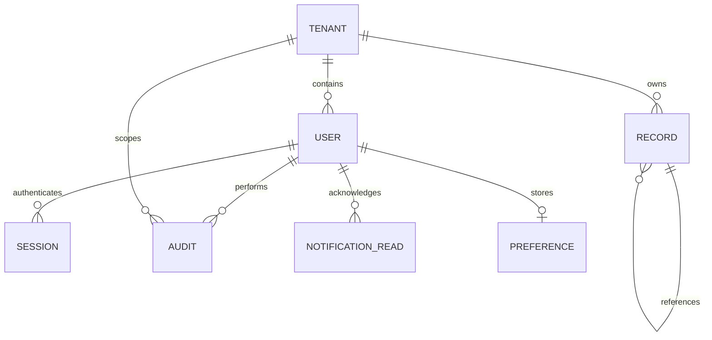

# Architecture and data model

## Current local architecture

React 19 + TypeScript provides the interactive shell. Vinext and Vite serve routes and the versioned REST API. Cloudflare's local Workers runtime executes server code, with local D1/SQLite for persistence. The Sites starter and existing UI primitives are reused; no hosted Site was registered or deployed. The app is intended for localhost development.

The modular monolith has three principal boundaries: `lib/server/service.ts` for authenticated persistence and commands, `lib/domain.ts` for deterministic accounting/date validation and dashboard aggregation, and client components for display and navigation. Frontend code formats money but does not decide ledger truth.

Shared-schema tenant IDs provide inexpensive isolation. Authentication obtains tenant identity from the session, never from a request body. Every record read, write and reference lookup uses that identity. Four roles are server-enforced. More granular field/record rules, tenant switching and per-tenant keys are later work. This is application-layer isolation, not PostgreSQL row-level security.

## Entities and relationships

`records` holds discriminated domain records in validated JSON, with kind, tenant, financial year, version and timestamp columns. Customers/vendors are shared references for sales/purchases. Products/warehouses are referenced by movements. Posted invoices/bills reference deterministic journal IDs. This flexible initial schema is not a substitute for a mature relational finance schema: extracting typed module tables and database-level foreign keys for domain references is a planned migration.

Indexes cover tenant/kind/year and tenant/audit timestamp. D1 batch transactions keep journal postings and their audit event atomic. A deterministic journal primary key provides exactly-once posting. Conditional inserts make stock availability checks atomic. Status updates use optimistic versions. Database triggers reject audit updates/deletes through the application database interface; filesystem/database administrators are outside that protection.

## Money and dates

Store money as integer minor units, validate no more than two decimals, bound values, and require exact balanced debit/credit totals. Currency codes remain separate. No frontend FX estimation. Fiscal years run April–March. Ledger history through the selected date determines dashboard balances; selected-period entries determine sales, profit and cash flow. Orders are FY-scoped snapshots. Stock quantities include all posted movement history.

Current limitations: whole-unit inventory, no settlement allocation, no tax lines, no automatic stock valuation, no multi-line invoice or product COGS matching. The initial chart of accounts is fixed. Gross profit relies on complete cost-of-goods journals.

## Security implemented

PBKDF2-SHA256 password hashing with random salt and 100,000 iterations; random opaque session tokens stored as SHA256 digests; HttpOnly SameSite Strict cookies (Secure on HTTPS); eight-hour or seven-day expiry; five failures per email per 15-minute window; Origin checking and JSON-only mutation requests; tenant/role checks; immutable audit triggers; safe CSV cell prefixes; no credentials in source. Password changes revoke every session. Setup is one-time and restricted to loopback hostnames.

## Production work still required

Use a stable supported production framework/runtime, PostgreSQL with migrations and row-level policies if selected, explicit module schemas, stricter request schemas and pagination, robust distributed throttling, CSRF-token review, SSO/MFA, encrypted disks/backups, secrets management, security/dependency audit, data-retention controls and restore drills. Add a transactional event outbox before message-broker publication; then introduce queue consumers/webhooks with idempotency and retries. No Kafka, RabbitMQ or Redis service is claimed today.

Performance targets (order creation under 500ms P95), 99.9% SLA and recovery objectives are goals, not measured guarantees. Production CI needs staging migrations, load tests, telemetry, traces, alerting, backup automation and a rollback procedure. Local GitHub CI currently checks types, integration tests and the production bundle.
